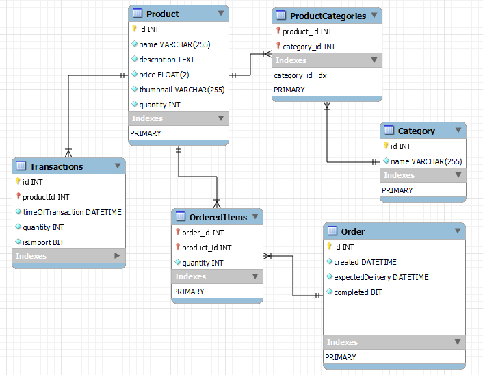

# Inventory management system

## Database layout

### MySQL or H2-database



## API endpoints

### Swagger REST API docs:
http://localhost:8080/swagger-ui/index.html#/

### product-controller
- GET all products `:8080/api/products`
- GET product `:8080/api/products/{productId}`
- GET product thumbnail `:8080/api/products/thumbnail/{productId}`
- POST, add new product `:8080/api/products/`
- POST, add new thumbnail to product `:8080/api/products/thumbnail/{productId}`
- PUT, update product details: `:8080/api/products/{productId}`
- DELETE product: `:8080/api/products/{productId}`
- PUT, Add category to product `:8080/api/products/{productId}/{categoryId}`
- DELETE category to product `:8080/api/products/{productId}/{categoryId}`

### order-controller
- GET all orders `:8080/api/orders`
- GET order `:8080/api/orders/{orderId}`
- POST, add new order `:8080/api/orders/`
- DELETE order `:8080/api/orders/{orderId}`
- PUT, edit order status `:8080/api/orders/{orderId}`
- PUT, add new product to order `:8080/api/orders/{orderId}/{productId}`
- DELETE product from order `:8080/api/orders/{orderId}/{productId}`

### category-controller
- GET all categories `:8080/api/category`
- GET category `:8080/api/category/{categoryId}`
- POST, add new category `:8080/api/category`
- DELETE category `:8080/api/category/{categoryId}`
- PUT, edit category name `:8080/api/category/{categoryId}`

### storage-controller
- POST, add some product to the storage `:8080/api/storage/{productId}`
- DELETE, remove some product from storage `:8080/api/storage/{productId}`
- GET the content of storage `:8080/api/storage/`

## Models

- Product
- Category
- Order
- OrderedItems

## Example POST requests:

### Create new product
```json
{
  "name": "string",
  "description": "string",
  "price": 0
}
```

### Create new category
```json
{
  "name": "string"
}
```

### Create new order
```json
{
  "expectedDelivery": "2022-11-11T13:07:13.911Z"
}
```


## Thumbnail location 

Go to the `application.properties` and edit `image_location` property
The products' thumbnails will save in this folder.

If you add a new product to the database the `thumbnail` property value will be automatically set to `default.png`.

## Configure mysql database with XAMPP
1. Go to phpmyadmin and create a new database
2. Configure the following properties in `application.properties` 
3. `spring.datasource.username=YOUR MYSQL USERNAME`
4. `spring.datasource.password=YOUR MYSQL PASSWORD`
5. `spring.datasource.url=jdbc:mysql://localhost:3306/YOUR DATABASE NAME`
6. And you're done because JPA generates the db schema automatically

## Configure with H2 in-memory database
1. Configure the following properties in `application.properties`
2. `spring.datasource.url=jdbc:h2:mem:YOURDBNAME`
3. `spring.datasource.driverClassName=org.h2.Driver`
4. `spring.datasource.username=YOUR USERNAME` 
5. `spring.datasource.password=YOUR PASSWORD`
6. `spring.jpa.database-platform=org.hibernate.dialect.H2Dialect`
